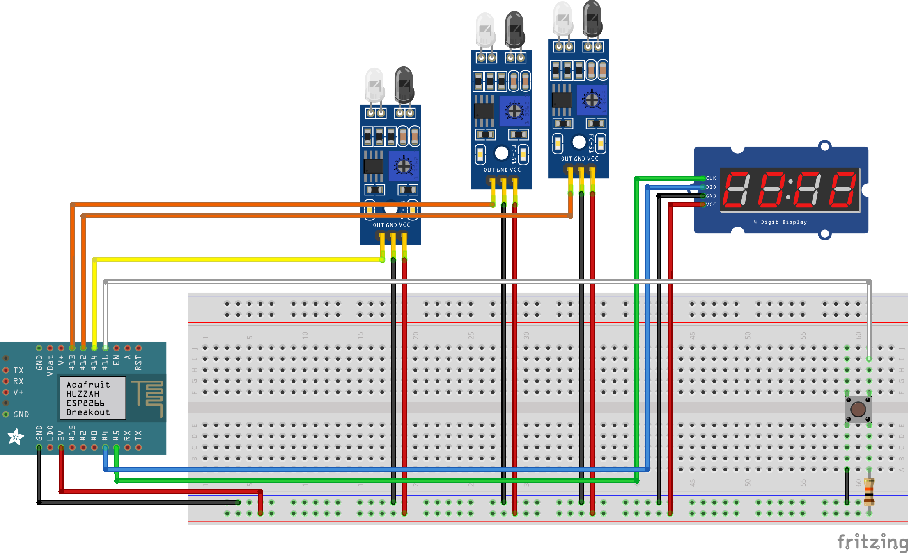

# NibblyKibbleTimingSystem
Timing System for the Nibbly Kibble Raceway

## About the Nibbly Kibble Raceway
The Nibbly Kibble Raceway is a a 180-stud-long two-lane Lego car drag strip, with an
electronically-controlled timing system inspired by and reverse engineered from the
[circa-2018](https://www.youtube.com/watch?v=ZsoP0Kqq-NI)
system used by [3DBotMaker](https://www.3dbotmaker.com/)
on [Race Mountain Speedway](https://www.youtube.com/channel/UCjN5K3IYZgz-vCWhI_DD01A)
(I didn't come across
[this circuit diagram](https://www.3dbotmaker.com/forum/main/comment/5e0680731671060017170f59)
until after I'd already built my system, which is a shame, because it would have saved me
_so_ much trial and error).

## The Timing System

The timing system is triggered automatically using a trio of infrared obstacle sensors.

The timer starts when the first sensor stops detecting the wooden block that holds the
starting gate (more on that in a different project) and then stops when the crossed
beams, created by a pair of IR sensors on the finish line, is interrupted.

The elapsed time of the race is displayed on a four-digit seven-segment display.

The system automatically resets once the race ends and the starting gate is reset (the
starting sensor detects the starting block).

The system also has a manual push button for testing and diagnostics, which manually
moves the system between the various race states (staged, running, finished).

The times of every race in a session are served as plaintext via a simple web server.
Honestly, I haven't found this to be particularly useful, but it was fun to experiment
with.

## Parts List
I encourage anyone attempting to re-create this project not to adhere too strictly to this
parts list, which I'm providing sheerly for the sake of reproducibility. There is no
need to use a Feather Huzzah over any other ESP-based development board, and really,
as the web server is more of a gimmick than anything else, I'd encourage folks to stick
with an Arduino Nano.

All components I selected were compatible with either 5V or 3.3V logic, so that should
give you some freedom as well.

- 1x Adafruit Feather HUZZAH ESP8266-based microcontroller
- 3x FC-51 IR obstacle detectors
- 1x TM1637 4-digit 7-segment display (decimal style preferred, clock style used for for my build)
- 1x tactile push button
- 1x 10 kΩ resistor
- plenty of insulated wire (22 AWG solid core)

## Demos
Coming soon!